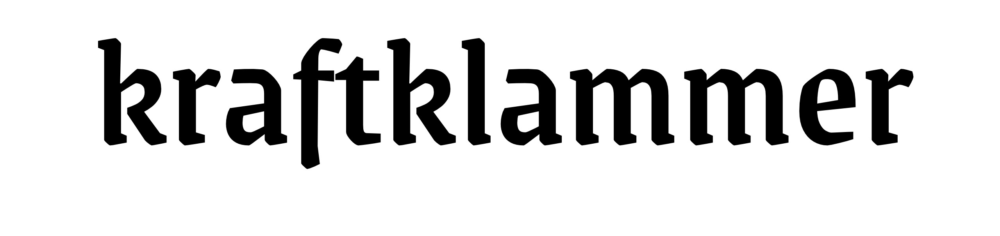

  

 

The clipboard mananger ``kraftklammer`` (German for "power paper clip") is based on a fork of [clipboard-manager](https://github.com/nardellil/clipboard-managery) originally created by [Luca Nardelli](https://github.com/nardellil) and released under a [MIT license](https://github.com/nardellil/clipboard-manager/blob/main/LICENSE). To acknowledge his work, ``kraftklammer``uses the [MIT license](./LICENSE) as well.

## tl;dr

Forward to the year 2026: as the author of these lines always used the straight-forward approach and simple clipboard manager [Clipy](https://github.com/Clipy/Clipy) that has been abandoned somewhen in the years 2020/21. As all software will break over time because OS interfaces or requirements change, the author always expected the original Clipy to stop working as it has some dependencies that rely on functions that have been declared deprecated by Apple. Furthermore, Clipy is not available as a native Apple Silicon app. 

Clipy's build process relies on the programming language Ruby and a lot of libraries. Although the author could build the original software by patching some files and adjusting the Ruby-based configuration (see below).

After examining Clipy's source code it became obvious that it was not worth the effort to port the original software to a more modern macOS environment.

Hence, after some research a viable alternative for building a clipboard manager that fits the author's requirements was discovered: [clipboard-manager](https://github.com/nardellil/clipboard-managery). This project relies on Swift alone and is therefore a much better option for building some knowledge about Swift without getting distracted by a lot of libraries as it would have been the case with Clipy. 

As a result, ``kraftklammer`` was born.

The main development goal of the project is to provide a maintained simple clipboard manager that will be extended with some features that will become handy for power users in particular (see below).
 

### Building ``kraftklammer``

__TODO__

## Requirements 

The original project could be built under macOS 15.x but active development fully transitioned to macOS 26.3 at the end of February 2026. Hence, the app might work with macOS 15.x but has not been tested there.

### Prerequisites

* An installation of XCode if you want to compile the source code.

### Project Building

The build process relies only on XCode.

__TODO__

## Vision for ``kraftklammer``

* support for dark mode ✔︎
* native build for Apple Silicon ✔︎
* encrypted data storage for persistence ✔︎
* sorting of clipboard history by usage and timestamp ✔︎
* fine control over various settings (history handling, display size etc.)
* time-based removal of passwords
* support Wake-on-LAN calls
* support for direct calls of user-specific shell scripts, e.g. for shutting down remote servers

## License
``kraftklammer`` is available under the MIT license. See the [LICENSE](./LICENSE) file for more information.

## Building Clipy in 2026

__TODO__